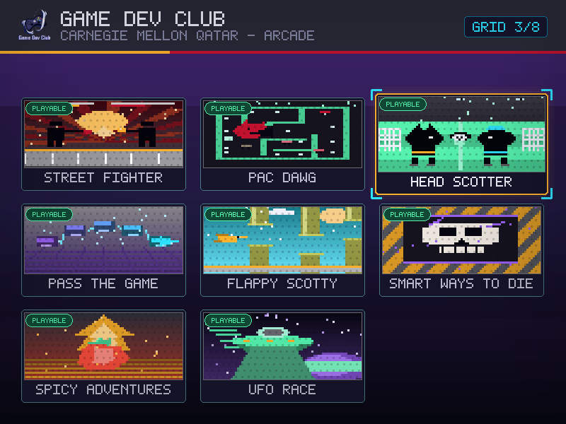
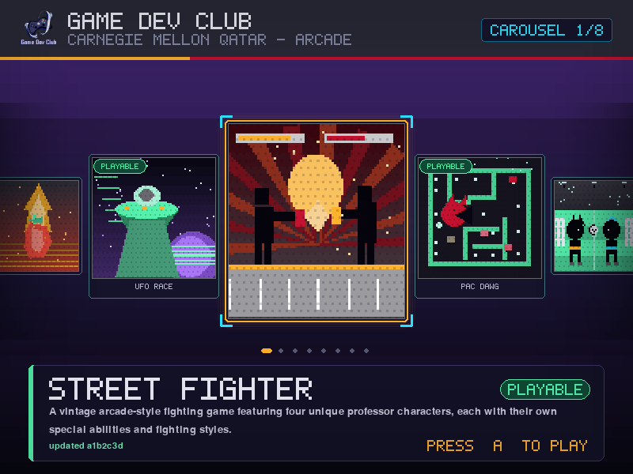
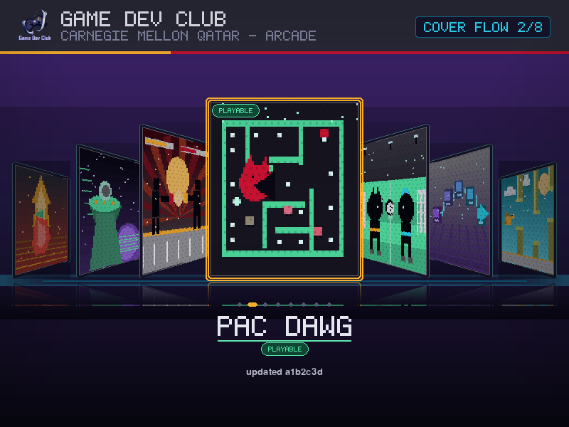
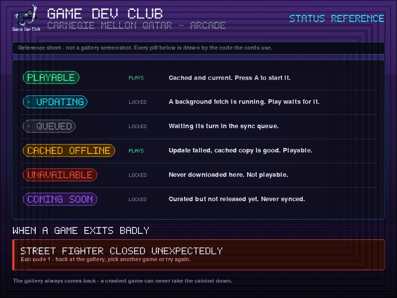

<p align="center">
  
</p>

<h1 align="center">GDC Arcade Launcher</h1>

<p align="center">
  The front door to the Game Dev Club arcade cabinet at Carnegie Mellon University in Qatar.
</p>

---

## What it is

`ArcadeLauncher` is the gallery that greets whoever walks up to the CMU-Q arcade
cabinet. It shows the club's games as a curated wall of cards, lets a visitor
browse them with the joystick alone, and starts the one they pick.

It is a **launcher**, not a game. It owns no gameplay. Its whole job is to look
like it belongs on an arcade machine, keep the club's catalogue current, and get
out of the way the moment somebody presses a button — then be there again when
they come back.

Three things make it more than a menu:

- **A supervisor, not a wrapper.** The launcher completely releases the display,
  the audio device and every joystick before a game starts, then runs the game as
  a separate process. Games do not have to know the launcher exists, and a game
  that crashes cannot take the cabinet down with it — the gallery simply comes
  back with an explanation.
- **Three real view modes.** Grid, Carousel and Cover Flow are three genuinely
  different compositions of the same catalogue, not one layout with the spacing
  changed. Press `Select` to cycle them live.
- **It survives a dead network.** The cabinet's Wi-Fi at a club fair is a rumour,
  not a fact. Games are cached on disk, updates happen in the background, and a
  failed update never blocks play — it just labels the card honestly.

## Architecture

The codebase is layered, and the layering is enforced by a test
(`tests/test_repo_hygiene.py::LayeringTests`).

```
main.py                    arcade entrypoint: parse args, wire everything, exit cleanly
│
├── launcher/              PURE LOGIC — none of these import pygame
│   ├── paths.py           every filesystem location, resolved once
│   ├── errors.py          the exception vocabulary
│   ├── manifest.py        parse + validate data/games.json; path containment rules
│   ├── settings.py        config/launcher.json + ARCADE_LAUNCHER_* env overrides
│   ├── viewmodes.py       the ViewMode enum and its cycle order
│   ├── status.py          GameState / GameStatus / Notice — what a card says
│   ├── cache.py           the on-disk git checkout cache (clone, update, verify)
│   ├── sync.py            background updates on a worker thread
│   ├── controls.py        the arcade button map (b=0 … p1=5 … Start=9)
│   ├── input_state.py     axis deadzone, debounce, auto-repeat
│   ├── attract.py         the idle-triggered attract-mode state machine
│   ├── previews.py        attract preview manifest schema + path containment
│   └── supervisor.py      the outer loop: run UI → launch child → run UI → …
│
├── launcher/gallery.py    the Pygame session (the UI half of the supervisor loop)
│
├── launcher/ui/           RENDERING — the only place pygame is imported
│   ├── theme.py           palette, fonts, spacing tokens
│   ├── surfaces.py        an LRU cache so nothing is redrawn needlessly
│   ├── art.py             procedural cover art, seeded per game
│   ├── preview.py         decodes + caches a game's attract preview frames
│   ├── effects.py         glows, gradients, reflections
│   ├── viewmodel.py       GalleryFrame — an immutable description of one frame
│   ├── components.py      shared widgets: header, status badges, banner, toast
│   ├── views/             grid.py · carousel.py · coverflow.py
│   ├── scene.py           picks the view and renders it
│   └── fatal.py           branded on-screen error, for failures before the gallery
│
└── tools/generate_previews.py   renders the screenshots in this README
```

### The supervisor loop and the two-level exit

The single most important design decision is that the launcher and a game are
**never alive at the same time**.

```
Supervisor.run()
  ├─▶ GallerySession(state)          SDL up · browse · returns UiOutcome
  │     └─ finally: release SDL      display, audio and joysticks handed back
  ├─▶ ProcessGameRunner(...)         [sys.executable, "main.py"] with cwd=<checkout>
  │     └─ waits for the child to exit; captures its output to a file
  └─▶ back to GallerySession(state)  with a notice if the child crashed
```

`StreetFighter/pygame_compat.py` calls `pygame.init()` at import time. If the
launcher still held the display, the child would open onto a surface it does not
own. That is why `GallerySession.__call__` releases SDL in a `finally` block
rather than at the end of the loop body — even a crash inside the gallery gives
the hardware back.

This produces the **two-level exit** a visitor experiences:

| Where you are | Press `P1` | What happens |
| --- | --- | --- |
| Inside a game | `P1` | The game exits. You are back at the gallery. |
| At the gallery | `P1` | The launcher exits `0`. You are back at the arcade menu. |

Nobody has to learn two different buttons. The same button always means *"take
me back one level."*

## Controls

Everything is reachable from the joystick and buttons. There is no mouse — the
cursor is hidden at start-up, and no interaction requires one.

### On the cabinet

| Input | Button id | Action |
| --- | --- | --- |
| Joystick ← → | axis 0 | Previous / next game |
| Joystick ↑ ↓ | axis 1 | Grid: previous / next row. Carousel and Cover Flow: previous / next game |
| `A` | 1 | **Play** the selected game |
| `Select` | 8 | Cycle view mode: Grid → Carousel → Cover Flow → Grid |
| `P1` | 5 | **Exit** to the arcade menu |
| `B` `X` `Y` `Start`, insert money | 0, 2, 3, 9, 4 | Unbound, deliberately. Three buttons is the whole vocabulary — a visitor should never have to guess. Insert money in particular does nothing: the arcade is free. |

The stick is digital, so each axis is treated as a switch with a `0.5` deadzone.
Holding a direction steps once, pauses `380 ms`, then repeats every `140 ms`; all
three values live in `config/launcher.json`.

Messages clear themselves: an error banner disappears on the next thing you do,
and the "not ready yet" pop fades after about 1.5 seconds. There is nothing to
dismiss and no dialog to get stuck in.

### On a keyboard (development)

| Key | Action |
| --- | --- |
| Arrow keys or `WASD` | Navigate |
| `Enter` or `Space` | Play |
| `Tab` | Next view mode |
| `1` `2` `3` | Jump straight to Grid / Carousel / Cover Flow |
| `Esc` | Exit |

There is no on-screen legend for any of this — the tables above are the
documentation. A visitor only ever needs three buttons and the stick, and a
permanent reminder of that on the screen read as clutter more than it helped.

## Attract mode

Leave the cabinet alone for 30 seconds (`attract_idle_ms`, default `30000`)
and the gallery starts demoing itself: it picks a random view mode, glides
between games the same way a visitor's own stick press would, settles on
one, and plays that game's own short looping preview animation inside its
card — then picks a different view mode and repeats. Only games that are
launchable, currently playable, and actually ship a preview animation are
ever chosen as a target — a coming-soon card, or a launchable game with no
preview yet, would just sit there frozen for the whole dwell period, which
reads as broken rather than as a showcase. If no game qualifies, attract
never engages at all; if exactly one does, attract settles on it once and
stays there rather than cycling view modes with nothing to actually glide
between. It never launches a game, never syncs, and never touches the
network.

**Any input ends it instantly** and puts the gallery back exactly where the
visitor left it — same game selected, same view mode — because the press that
wakes the screen back up is spent purely on that: it is never also treated as
a launch, a view change, or (importantly) an exit, so dismissing attract with
`P1` does not also quit the gallery. The idle clock re-arms the moment attract
is dismissed, so another 30 seconds of silence drops back into it.

The preview animation is supplied by the game, not invented by the launcher:
see [What a game must provide](#what-a-game-must-provide). A game with no
preview keeps showing its ordinary procedural card art, attract or not.

## Setup

Requires **Python 3.10 or newer** and `git` on `PATH`. The cabinet runs Python
3.10, so 3.10 is the floor this is tested against, not just the minimum in
theory.

```bash
git clone https://github.com/GDC-CMU/ArcadeLauncher.git
cd ArcadeLauncher
python -m pip install -r requirements.txt
python main.py
```

Useful flags while developing:

```bash
python main.py --no-sync      # never touch the network; use whatever is cached
python main.py --verbose      # log every cache and subprocess decision
python main.py --cache /tmp/x # put the game checkouts somewhere disposable
python main.py --help         # the full list
```

Run the tests and regenerate the screenshots:

```bash
python -m unittest discover -s tests -v
python -m tools.generate_previews
```

The test suite is fully offline and headless — it clones only local fixture
repositories and forces the SDL dummy driver, so it is safe to run anywhere.

## Deploying to the CMU-Q arcade

The cabinet is a RetroPie Linux box (x86-64, Python 3.10). Games live in
`/home/es/RetroPie/roms/cmu_graphics/<Name>.git`, and **the directory name is
what appears on the outer menu** — so name it the way you want visitors to read
it. The `.git` suffix is part of the convention on that box, alongside
`Tarnival-StreetFighter.git` and `Professor-Invaders.git`. For each entry the
menu pulls the repository, installs `requirements.txt` into a per-game
virtualenv at `<game-dir>/retropie-venv`, then runs `main.py`.

Installing is one clone. This repository is public, so a plain HTTPS clone is
all it takes — no deploy key, no SSH host alias:

```bash
cd /home/es/RetroPie/roms/cmu_graphics
git clone https://github.com/GDC-CMU/ArcadeLauncher.git "Arcade-Launcher.git"
```

Then restart the box and the new entry appears on the menu.

> The deploy-key and SSH-host-alias procedure in the maintainer's instructions
> is only needed for **private** repositories. This one is public.

After that, a deploy is just a push to `main` — the cabinet pulls it on the next
boot. What that means for this repository:

1. **Merge to `main`.** The cabinet pulls this branch; there is no build step.
2. **Keep `main.py` at the repository root.** The arcade menu invokes it by that
   exact path. Do not rename or move it.
3. **Do not assume a working directory.** It is not documented which directory
   the menu runs `main.py` from, so nothing here resolves a file relative to it
   — every path comes from the package's own location. See
   [Cabinet-specific hazards](#cabinet-specific-hazards).
4. **Keep `requirements.txt` installable.** The menu builds a virtualenv per
   game from it. It pins `pygame-ce`, the maintained fork the cabinet already
   uses.
5. **Exit codes matter.** The launcher returns `0` on a normal exit — that is
   what tells the arcade menu the session ended cleanly. It returns `1` only if
   it could not start at all, and in that case it first paints a readable,
   branded error screen so a club member standing at the cabinet can see what
   went wrong instead of a black rectangle.
6. **First boot needs the network.** The initial run clones each launchable game
   — StreetFighter included — into `.arcade-cache/games/<id>`. Do this while the
   box still has network. After that the cabinet can run indefinitely offline.

The display is opened at **800×600** with `pygame.SCALED`, so SDL letterboxes the
gallery onto whatever panel is fitted without the layout changing.

### Cabinet-specific hazards

Five failure modes exist only on the cabinet and never on a development machine,
which is exactly what makes them dangerous. All are handled, and each has tests
that fail if the handling is removed.

**The `cmu_graphics` Pygame shim.** The box has `cmu_graphics` installed — the
ROM folder is named after it — and it ships a module that answers to the name
`pygame` without being Pygame. If it wins the import, anything that did a plain
`import pygame` dies before drawing a frame. So nothing here imports Pygame
directly: [`launcher/ui/pygame_runtime.py`](launcher/ui/pygame_runtime.py)
imports it, checks the result really does provide `init`, `display`, `Surface`,
`event`, `font` and the rest, and if it finds a shim it drops **only** that
one `sys.path` entry, clears the module cache and re-imports. If no real Pygame
can be found it raises — it never calls `sys.exit()` — so `main.py` still paints
the branded error screen and still owns the exit code.

**The unknown working directory.** `data/games.json`, `config/launcher.json`,
`assets/branding/gdc-cmu-logo.png` and `.arcade-cache/` are all resolved from
`__file__` in [`launcher/paths.py`](launcher/paths.py), never from
`os.getcwd()`. A single working-directory-relative path would work on every
developer's machine and fail on the cabinet with "manifest not found".
`tests/test_paths.py` proves it by loading everything from an unrelated
directory, in-process and in a fresh interpreter, and refuses to let
`Path.cwd()`, `os.getcwd()` or a relative path literal back into the package.

Games are unaffected by that: a game is still started with **its own checkout**
as the working directory, which is what puts its directory on the child's
`sys.path[0]` so its sibling imports keep resolving.

**Termination has to actually terminate.** The arcade menu stops the launcher by
sending `SIGTERM`, and the cabinet's documented recovery for a process that will
not quit is the physical reset button — which the box's maintainer warns risks
filesystem corruption. The signal handler sets a shutdown flag, but a flag only
read *between* gallery sessions is useless: an idle cabinet never leaves its
session, so the launcher logged the signal and kept running. The gallery loop now
polls that same flag every frame and leaves as though the visitor had pressed
exit, so SDL is released, the sync worker is stopped and any running game is
terminated rather than orphaned. Measured on Linux: **0.05 s** for `SIGTERM` and
`SIGINT`, both exit code 0.

**A joystick is announced twice.** SDL reports a device that is already plugged
in through both the start-up `get_count()` enumeration *and* a `JOYDEVICEADDED`
event, so the cabinet's two sticks produced four "joystick attached" lines. Each
duplicate opened a second SDL handle and replaced the first without closing it.
Devices are now keyed by SDL instance id and re-adding a known one is a no-op
that closes the duplicate handle. Navigation was never affected — held
directions are merged as a set, so a doubled device could not double-step the
selection — and there is a test pinning that, so it stays true.

**No SDL-backed object may outlive the SDL session that created it.** A game
exiting cleanly and the launcher never coming back — with no traceback, no
error, nothing after the child's own "exited with code 0" line — was reported
directly from a cabinet console, and later reproduced exactly: `pygame.error:
Couldn't find glyph` followed by `Windows fatal exception: access violation`,
inside the very first `font.size()` call after the gallery reopened. The
`GallerySession`'s renderer used to be built once, in `__init__`, and reused
for every launch — but `_release_sdl()` runs `pygame.font.quit()` and
`pygame.quit()` between every game, which free every cached `Font` and
`Surface` at the C level. The long-lived renderer kept drawing with the same
Python objects afterwards, now pointing at freed memory: readable as a
missing glyph on the next font lookup, then an access violation on the next
Surface blit — and it took out the *error-notice* banner along with
everything else, since that path draws with the same cached fonts, turning a
recoverable failure into a silent crash. The renderer (and everything it
caches — fonts, surfaces, the logo, decoded preview frames) is now rebuilt
from scratch in `_open_display()` and dropped in `_release_sdl()`, so a stale
reference cannot exist to be drawn with; `tests/test_gallery.py::
RendererLifetimeTests` pins it, including one test that reproduces the exact
access violation above against the pre-fix code.

Separately, and worth keeping regardless: every route out of
`Supervisor.run()` now logs at INFO or louder before it returns or raises,
including the loop's own fall-through and a last-resort handler for anything
that is not even an `Exception` subclass (a stray `SystemExit`), so a genuine
Ctrl+C, a crashed gallery and a silent process death are never
indistinguishable in the log again. `main.py` also enables Python's
`faulthandler` at start-up — it cannot prevent a fatal native fault inside a
C extension such as SDL, but it prints what every thread was doing at the
moment of one, which is what first pointed at the crash above instead of
nothing. A launched game now also runs in its own console process group
(`CREATE_NEW_PROCESS_GROUP` on Windows, `start_new_session` on POSIX) — the
same isolation `launcher/cache.py` already gave git subprocesses — so a
Ctrl+C aimed at the launcher's console and whatever the game's own SDL/input
layer does with a console signal can never be mistaken for one another.

## Offline behaviour

**Yes, the cabinet works with no Wi-Fi.** Every game already cached keeps
playing exactly as before; the gallery stays fully interactive and browsable;
cards that are cached read `CACHED OFFLINE` instead of `PLAYABLE`, and only a
game that has *never* downloaded successfully on this cabinet shows
`UNAVAILABLE`. The one real requirement is that each game needs the network
**once**, the first time it is ever added — after that first successful
clone, it is on disk for good and a dead network cannot take it away.

Game checkouts live in `.arcade-cache/` (git-ignored, never committed). Each
launcher process checks its launchable games **once at startup**, on a background
thread while the gallery remains browsable. Missing games are cloned; installed
games are fetched for changes, not downloaded from scratch.

**Playing again does not contact GitHub.** Launching a game and returning to the
gallery reuse the checked local copies. Duplicate sync requests are ignored,
including after a failed check. To pick up a newly published build or retry after
Wi-Fi returns, exit and restart the launcher. There is no multi-hour freshness
timer and no new maintenance control: a new process starts a new check.

**Network waits stay bounded.** Each git command has a `network_timeout_s` limit
(`8` seconds by default; see `config/launcher.json`). After a network timeout,
subsequent startup checks fail fast during the runner's short retry cooldown,
letting installed games fall back to `CACHED OFFLINE`. There is no additional
pre-launch network wait once a game's startup check has finished.

Each card reports exactly what is true of it right now, including the short
commit id of the build it is showing — the answer to "am I running the
latest?" without needing a terminal:

| Badge | Meaning |
| --- | --- |
| `PLAYABLE` | Cached and verified by this process's startup check. Press `A` to start it. Its detail line identifies the installed commit. |
| `UPDATING` | The startup check is pending or running. Wait for it to finish before launching this game; browsing remains available. |
| `CACHED OFFLINE` | The update failed, but a good checkout is already there. Fully playable, and its detail line still names the cached commit. |
| `UNAVAILABLE` | Never successfully downloaded on this cabinet. Not playable. |
| `COMING SOON` | Curated in the manifest but not released yet. Not playable. |
| `QUEUED` | Waiting its turn in the sync queue. |

Colour, label *and* — for the busy states — a pulsing dot all encode the same
thing, so the distinction survives a photo, a dim projector or a colour-blind
visitor.

The rules that follow from this:

- **A failed update never removes a working game.** A fetch that fails downgrades
  the badge to `OFFLINE` and leaves the checkout alone.
- **A ready game launches locally.** No new fetch is requested on Play or on
  gallery return. A checkout guard prevents an update from modifying files
  while that game's child process is running.
- **Coming-soon entries never touch the network.** They structurally carry no
  repository, ref or entrypoint, so there is nothing to clone.
- **Nothing outside the cache is ever executed.** Every entrypoint is resolved
  against its own checkout directory and rejected if it escapes — `..`, absolute
  paths and symlink tricks all fail validation before a process is spawned.
- **`--no-sync` is a hard promise.** In offline mode `git` is not invoked at all:
  startup and pre-launch readiness checks verify only what is already on disk.

## Screenshots

Three deliberately different compositions of the same eight games, under one
identical header. All are rendered from the real view code by `python -m
tools.generate_previews`, at the cabinet's exact 800×600, and a test fails if
they drift out of date.

The header -- logo, wordmark, subtitle and the mode chip -- is drawn by a
single shared component and never changes as you cycle views: same wording,
same size, same position. Everything that makes the three modes look
different lives in the content area below it.

They show the shipped `data/games.json` exactly as a healthy cabinet would --
three playable games and five in development. Availability lives entirely on the
per-card badge; nothing here is a mock-up.

`docs/screenshots/render-manifest.json` records the SHA-256 of every PNG, a
fingerprint of the code and data that produced them, and the Pygame/SDL_ttf
build that rasterised them. `tests/test_previews.py` recomputes the fingerprint
and tells you to regenerate if the UI changed — that check is exact and runs
everywhere. The stricter pixel-for-pixel comparison is skipped, with a message
saying so, when your Pygame differs from the recorded one: different SDL_ttf
builds antialias the same bundled font differently, so identical UI produces
different bytes. Regenerate on any machine; the fingerprint is what has to
match, not the pixels.

### Grid — *see everything at once*

A board of equal cards, always three columns -- four would be unreadable at
800x600 -- sized to the rows actually needed: 1-3 games get one big row, 4-6
get two, and 7 or more get the permanent maximum of three. Past nine games the
board scrolls vertically instead of growing a fourth row or paginating:
pressing down past the last visible row eases the view down by exactly enough
to keep the selection in sight, with a restrained sliver of a scrollbar as the
only hint that there is more below. Focus is carried by a raised card, a
bright rule and a glow rather than by size.



### Carousel — *one game, properly introduced*

A single hero card centre stage, flanked by dimmed neighbours that glide in and
out as the selection changes, over a full-width description panel. Position
dots mark the selected game's place in the row.



### Cover Flow — *the arcade showpiece*

A pseudo-3D shelf: cards recede in perspective with depth-scaled dimming, sitting
on a reflective floor under a horizon glow. The selected title sits below the
shelf where nothing overlaps it.



### Status badges — *reference sheet*

Not a gallery screenshot. With the current manifest an honest frame can only ever
contain `PLAYABLE` and `COMING SOON`, because the other four states are reached by
syncing and a coming-soon entry is never synced. Rather than invent states for real
club games, the full vocabulary is shown here — drawn by the same
`draw_status_badge` the cards use, so the two can never drift apart — alongside the
banner the supervisor raises when a game exits badly.



## Changing the look

Restyling the launcher does not mean hunting through three view files — the
shared pieces each live in exactly one place:

- **Colours** — the single named palette is `PALETTE` in
  `launcher/ui/theme.py`. Every view, badge and effect pulls its colours from
  there by name (`PALETTE["cmu_red"]`, `PALETTE["electric_cyan"]`, ...), so
  changing an entry once changes it everywhere it is used, consistently
  across all three modes.
- **Backdrop** — the dark gradient field behind every view is
  `Renderer.background()` in `launcher/ui/scene.py`. It is built once per
  screen size and cached, so a change there is still cheap.
- **Header / marquee** — the logo, wordmark, subtitle and mode chip are
  `draw_gallery_header()` in `launcher/ui/components.py`. It is deliberately
  the *only* place that draws the header: all three views call it as-is
  rather than composing their own, which is what keeps it identical no
  matter which view is on screen. Change it there and every view picks it up.
- **Card art** — the procedural, seeded-per-game cover art is
  `render_card_art()` in `launcher/ui/art.py`, driven entirely by each game's
  `art` block in `data/games.json` (`motif`, three `palette` names, and a
  `seed`). Adding a new look means adding a motif function there and picking
  it by name in the manifest — no image asset to draw or ship.

## Changing the default gallery mode

The mode shown when the cabinet boots is `default_view` in
`config/launcher.json`:

```json
{
  "default_view": "carousel"
}
```

Valid values are `grid`, `carousel` and `cover-flow`. To try one without editing
the file:

```bash
ARCADE_LAUNCHER_VIEW=cover-flow python main.py     # Linux / macOS
$env:ARCADE_LAUNCHER_VIEW='cover-flow'; python main.py   # PowerShell
```

The same file also holds `fullscreen`, `frame_rate`, `sync_on_start`,
`nav_initial_delay_ms`, `nav_repeat_ms`, `axis_deadzone`, `network_timeout_s`
and `attract_idle_ms`. An invalid value is reported and replaced with the
default rather than crashing the cabinet.

## Adding a game

The gallery is **curated**: it shows exactly what `data/games.json` lists, in that
order. Nothing is discovered automatically, because an arcade at a club fair is
the wrong place to find out that somebody's work-in-progress does not start.

Add an entry and open a pull request:

```json
{
  "id": "flappy-scotty",
  "title": "Flappy Scotty",
  "description": "Navigate through tricky obstacles and protect Scotty.",
  "runtime": "python",
  "launchable": true,
  "repository": "https://github.com/GDC-CMU/FlappyScotty.git",
  "ref": "main",
  "entrypoint": "main.py",
  "art": { "motif": "flight", "palette": ["electric_cyan", "warm_amber", "ink"], "seed": 3303 }
}
```

| Field | Required | Notes |
| --- | --- | --- |
| `id` | yes | Lowercase, `a–z 0–9 -`. Also the cache directory name. |
| `title` | yes | Shown on the card. |
| `description` | yes | One or two sentences; the views wrap it for you. |
| `runtime` | yes | `python` today. |
| `launchable` | yes | `false` renders a `COMING SOON` card and nothing is cloned. |
| `repository` | if launchable | Must be `https://`. `git@`, `http://` and `file://` are rejected. |
| `ref` | if launchable | Branch or tag to pin. |
| `entrypoint` | if launchable | Repo-relative path. Must stay inside the checkout. |
| `note` | no | Small print under the description. |
| `art` | no | `motif`, a three-colour `palette` and a `seed` for the generated cover. |

Approving a game means flipping `launchable` to `true` and filling in
`repository`, `ref` and `entrypoint`. Then:

```bash
python -m unittest discover -s tests -v    # validates the shipped manifest
python -m tools.generate_previews          # refresh the screenshots
```

The manifest is validated at start-up. A malformed entry is a hard failure with a
named field and a readable message — the cabinet tells you which game is wrong.

## What a game must provide

To be launchable from this gallery, a game must:

1. **Be a public repository under `https://`.** Cloned shallow, single-branch,
   pinned to `ref`.
2. **Start from one file.** Run as `[sys.executable, "<entrypoint>"]` with the
   working directory set to its own checkout. Relative asset paths therefore work
   unchanged.
3. **Own the display.** The launcher has fully released SDL. The game calls
   `pygame.init()` and opens its own window, exactly as it would standalone.
4. **Exit on `P1` (button 5).** `sys.exit(0)` is enough. That is what returns the
   visitor to the gallery.
5. **Exit eventually.** The launcher waits for the child. A game that never exits
   holds the cabinet.
6. **Not require the network at runtime.** The fair's Wi-Fi will not be there.

No import of the launcher, no shared globals, no subclassing. Games stay
standalone programs — `StreetFighter` runs from this gallery **unmodified**.

Optionally, a game may also ship an **attract preview**: a short, pre-rendered
looping animation the gallery plays inside its card during attract mode (see
[Attract mode](#attract-mode)). It lives at a fixed location in the game's own
checkout:

```
assets/preview/manifest.json
assets/preview/frame_000.png
assets/preview/frame_001.png
...
```

```json
{
  "version": 1,
  "fps": 8,
  "frames": ["frame_000.png", "frame_001.png", "frame_002.png"]
}
```

- Entirely optional — a game without `assets/preview/` is not an error, and
  a coming-soon game (which has no checkout at all) never has one.
- Author frames small, at the card's aspect ratio (roughly 160×120–200×150)
  and keep the loop short (1–3 seconds). `fps` must be an integer, 1–30.
- The launcher never trusts this: every frame path is proven to stay inside
  `assets/preview/` in that game's own checkout (the same containment rule
  applied to `entrypoint`), and hard caps bound frame count, per-frame pixel
  dimensions and total decoded bytes. Anything missing, malformed, unreadable
  or over a cap is a single logged warning and a silent fallback to the
  game's ordinary procedural card art — never a crash, never a blank card.

## Troubleshooting

| Symptom | Cause | Fix |
| --- | --- | --- |
| Branded error screen at start-up | The manifest or config file is invalid, or unreadable | The screen names the file and the field. Fix it and re-run. |
| A card shows `UNAVAILABLE` | The game has never cloned successfully here | Check the network, then `python main.py --verbose` and read the git error. |
| Every card shows `CACHED OFFLINE` | No network, but the cache is good | Nothing to do — cached games still play. |
| `COMING SOON` on a released game | `launchable` is still `false` | Set it to `true` and fill in `repository`, `ref`, `entrypoint`. |
| "That game isn't ready yet" toast | You pressed Play on a non-playable card | Expected. The launcher refuses rather than failing halfway. |
| Game starts, then the gallery reappears with a banner | The child exited non-zero | The banner shows the exit code; `--verbose` logs the child's output. |
| Joystick does nothing | It was plugged in after start-up | Hot-plug is handled; if not, restart the launcher. |
| Nothing renders / black screen off-cabinet | No display available | `SDL_VIDEODRIVER=dummy` for headless runs, or use the preview tool. |
| Black screen on the cabinet, launcher never appears | `cmu_graphics` ships a Pygame shim that can win the import and shadow the real module | Already handled: `launcher/ui/pygame_runtime.py` detects the shim, drops only its `sys.path` entry and re-imports. If it still fails you get a branded screen, not a black one — `python main.py --verbose` names what loaded. |
| "manifest not found" on the cabinet only | Something resolved a repository file relative to the working directory, which the arcade menu does not guarantee | Already handled: every path derives from `launcher/paths.py`. If this reappears, `python -m unittest discover -s tests -v` will point at the offending file. |
| `pygame.error: No available video device` | Headless shell | Same as above. |
| Screenshot tests fail right after cloning | Your Pygame/SDL_ttf differs from the one that generated the committed PNGs | Not expected any more — that comparison now skips itself with an explanatory message. If a screenshot test *does* fail it means the UI really did change: run `python -m tools.generate_previews` and commit the result. |
| Launcher will not close; the menu cannot stop it | A termination signal was caught but the running gallery never saw it | Fixed: the loop checks the shutdown flag every frame and exits in ~50 ms. Never use the reset button for this — the maintainer warns it risks filesystem corruption. |
| Each joystick logged twice at start-up | SDL announces an already-connected device through both enumeration and `JOYDEVICEADDED` | Fixed: devices are keyed by SDL instance id, so the second announcement is ignored. Navigation was never double-stepping. |
| Launcher ends after a game exits, with nothing after "exited with code N" in the log | Fixed: the renderer used to be built once and reused, so it kept drawing with fonts/surfaces `_release_sdl()` had just freed — a stale font lookup, then a native access violation, on the very next session | The renderer is now rebuilt fresh every session and dropped on release; `RendererLifetimeTests` pins it. If a silent ending still recurs, `faulthandler` (enabled in `main.py`) prints the state of every thread at the moment of a fatal fault to the same stderr stream instead of nothing. |

## Club-fair preflight

Ten minutes before the doors open, on the cabinet:

1. `git pull` — the cabinet menu does this, but confirm it succeeded.
2. `python -m pip install -r requirements.txt` — confirm `pygame-ce` is present.
3. `python -m unittest discover -s tests -v` — must be all green.
4. **While you still have network**, run `python main.py` once and wait for every
   card to leave `UPDATING`. This fills the cache for the day.
5. Check the badges: every game you intend to demo reads `PLAYABLE`.
6. Launch each demo game and press `P1` — confirm you land back at the gallery.
7. From the gallery press `P1` — confirm you land back at the arcade menu.
8. Press `Select` three times — confirm all three views render and come back
   around to where you started.
9. Confirm the mode you want visitors to see first is the one that boots
   (`default_view`).
10. **Unplug the network and repeat step 6.** Cached games must still play. This
    is the check that actually saves the day.

---

<p align="center">
  <sub>Built by the Game Dev Club · Carnegie Mellon University in Qatar</sub>
</p>
